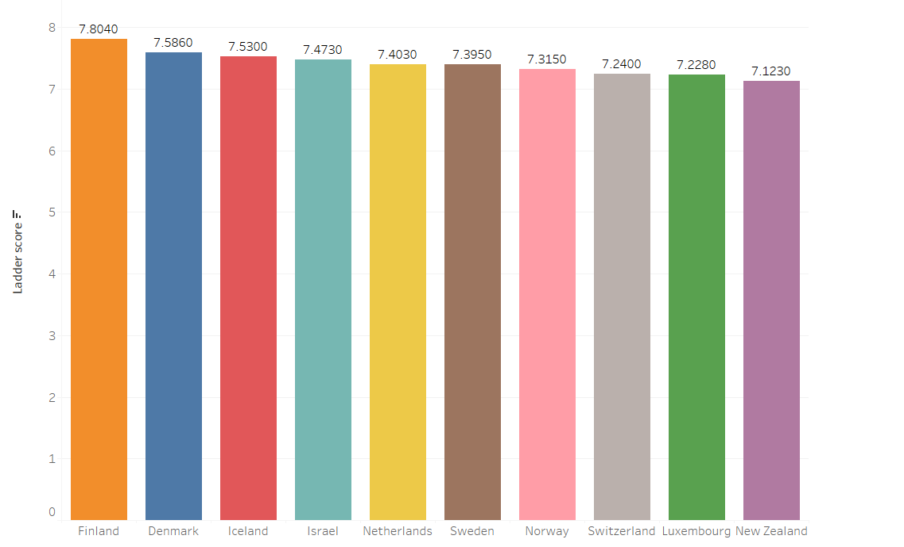
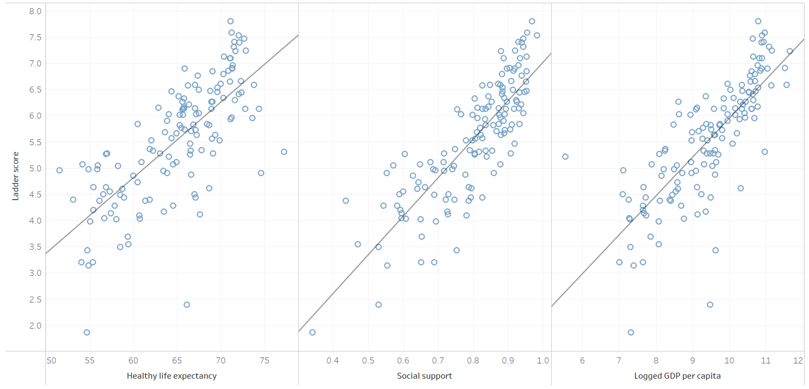

# World happiness project
## Description 
This project shows the visualization of the happiness score around the world. It shows the most and the least happiest countries, the top most happiest countries with their happiness report,  and how happiness can affect the life expectancy, social support and GDP of a country. It'll give you a overview about country wise happiness and how it can affect different aspects. 

## Environments used
Tableau Public

## Project walk-through

Darker the colour = happier the countires
<image src="worldhappiness(1).png"/> 

Top 10 happiest countries:   

Relationship of happiness score with life expectancy, social support and GDP   

# Final dashboard
.png)

